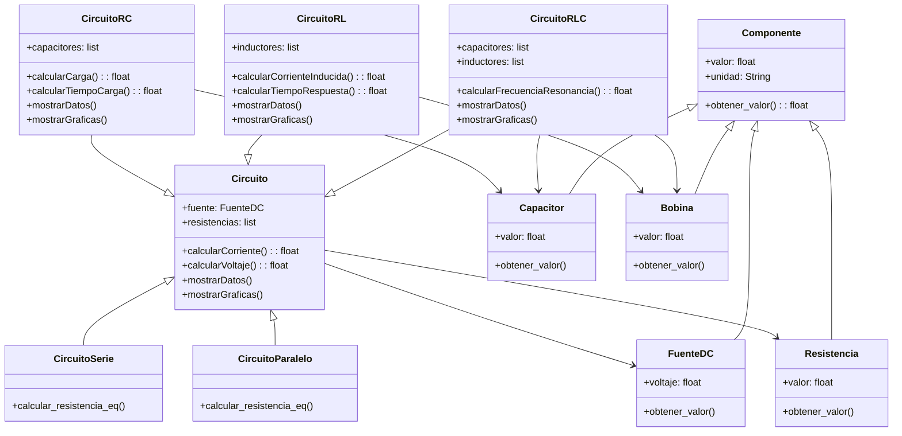

# **Simulador de circuitos**

## 📖 Índice:
+ [Integrantes](#integrantes)
+ [Alternativa](#alternativa-4)
+ [Solución Preliminar](#solución-preliminar)
    + [Interfaz de Usuario](#parte-1-interfaz-de-usuario-gui)
        + [Frame 1: Menú](#frame-1-menú)
        + [Frame 2: Simulador](#frame-2-simulador)
        + [Diagrama de clases](#diagrama-de-clases-de-la-interfaz)
    + [Lógica del simulador](#parte-2-lógica-para-la-simulación-de-los-circuitos)
        + [Clases (Componentes)](#clases-componentes)
        + [Clases (Cirrcuitos)](#clases-circuitos)
        + [Diagrama de clases](#diagrama-de-clases)
+ [Inspiración para la interfaz](#inspiración-para-la-interfaz)

## **Integrantes**
+ Juan Manuel Toro Rojas
+ Héctor Miller Patiño Avellaneda
+ Miguel Ángel Tovar Rincón

## **Alternativa 4**
Desarrollar una aplicación en Python que permita simular circuitos RC, RL y RLC simples. Condiciones:

+ Código original.
+ Uso de herramientas vistas en el curso (CLASES) - Los componentes deben aplicar el enfoque de POO (por ejemplo, una resistencia debe tener atributos como resistividad, potencia, etc.).
+ Se deben poder configurar los componentes en serie y en paralelo.
+ Se deben trabajar con fuentes de tensión en DC únicamente.
+ El resultado de la simulación debe ser una representación gráfica de la tensión/corriente en cada uno de los componentes.
+ Se pueden utilizar módulos externos para la solución de los componentes numéricos.

**Características extra:**
+ Hacer análisis en el dominio AC.

## **Solución Preliminar**
Para desarrollar este simulador de circuitos simples **RC, RL y RLC**, es necesario tener en cuenta las partes que se deben desarrollar. Para esta alternativa se requiere:
+ Interfaz de usuario (GUI).
+ Lógica para la simulación de los circuitos.

### **Parte 1: Interfaz de Usuario (GUI)**
***
#### **Frame 1: Menú**
En esta parte, se presenta un mensaje de bienvenida y el usuario verá un menú principal que le permitirá seleccionar entre los tres tipos de circuitos que se pueden simular: RC, RL y RLC. Este menú será el primer frame que el usuario encontrará al iniciar la aplicación.


**Características del Menú:**
+ Señal RC: Simulación de un circuito RC (Resistencia y Capacitor).
+ Señal RL: Simulación de un circuito RL (Resistencia e Inductor).
+ Señal RLC: Simulación de un circuito RLC (Resistencia, Inductor y Capacitor).

#### **Frame 2: Simulador** 
Este frame será una interfaz sencilla en la que el usuario podrá observar el circuito seleccionado en el menú anterior. Adicionalmente, en un contenedor ubicado en la parte derecha de la pantalla, el usuario podrá ingresar los parámetros de cada componente del circuito en cajas de texto. Los valores que se pueden ingresar son:
+ Resistencia.
+ Capacitor.
+ Inductor.
+ Fuente de energía.


Finalmente, el usuario podrá observar los datos del circuito en forma de gráficos en un contenedor ubicado en la parte inferior de la ventana. También habrá una opción para volver al menú principal y la opción de realizar la simulación con los mismos componentes en un circuito en serie y paralelo.

### **Diagrama de clases de la interfaz**
A continuación, se presenta el diagrama de clases de la GUI:

```mermaid
title Diagrama de clases de la Interfaz
classDiagram
    class VentanaPrincipal {
        +abrirVentana()
        +cerrarVentana()
        +ajustarTamano()
    }

    class Boton {
        +texto: String
        +clic()
    }

    class VentanaCircuito {
        +abrirVentana()
        +cerrarVentana()
        +ajustarTamano()
        +mostrarCircuito(tipo: String)
        +volverMenu()
    }

    class Contenedor {
        +mostrarContenido()
    }

    class ConfiguracionParametros {
        +bateria: Bateria
        +resistencia: Resistencia
        +capacitancia: Capacitor
        +inductancia: Bobina
        +modificarParametro()
    }

    class EstadisticasSimulacion {
        +mostrarGraficas()
        +mostrarDatos()
    }
    VentanaPrincipal --> Boton : contiene
    VentanaPrincipal --> VentanaCircuito : genera
    VentanaCircuito --> Boton : contiene
    VentanaCircuito --> Contenedor : contiene
    Contenedor --> ConfiguracionParametros : muestra
    Contenedor --> EstadisticasSimulacion : muestra
```

**Class VentanaPrincipal:**
Es la ventana inicial del simulador, donde el usuario puede seleccionar el tipo de circuito (RC, RL o RLC). Tiene métodos para abrir, cerrar y ajustar el tamaño.

**Class VentanaCircuito:**
Se genera cuando el usuario selecciona un tipo de circuito. Contiene métodos para abrir, cerrar, ajustar el tamaño, mostrar el circuito y volver al menú principal.

**Class Boton:**
Representa los botones de la interfaz. Contiene un texto y un método clic() para activar una acción.

**Class Contenedor:**
Se encarga de mostrar los diferentes elementos en la interfaz.

**Class ConfiguracionParametros:**
Contiene los valores de los componentes del circuito, como batería, resistencia, capacitancia e inductancia. Permite modificar estos valores.

**Class EstadisticasSimulacion:**
Muestra las gráficas y datos generados por la simulación del circuito.

### **Parte 2: Lógica para la simulación de los circuitos**
***
Para el desarrollo de la lógica del simulador, hay que tener en cuenta los factores que pueden afectar los valores de la simulación, tales como los parámetros de cada componente y si el circuito es en serie o en paralelo. Un buen primer paso es definir **qué objetos existirán** en este simulador, posteriormente **qué datos deben ser ingresados** y **qué datos pueden ser generados**, para finalmente desarrollar una **salida de datos en forma de diagramas y estadísticas**.

#### **Clases (Componentes):**
+ *Componente*: Es el elemento base para los diferentes componentes del circuito, que contiene el valor numérico, la unidad de medida y devuelve el valor con su respectiva unidad.
    + Fuente DC: Maneja el voltaje.
    + Resistencia: Devuelve el valor en ohmios.
    + Capacitor: Devuelve la capacitancia en faradios.
    + Bobina: Devuelve el valor en henrios de la inductancia.

#### **Clases (Circuitos):**
+ *Circuito*: Representa un circuito eléctrico genérico que puede contener una fuente de corriente continua (DC) y una colección de resistencias. Es la base para los demás tipos de circuitos a simular, este va a calcular la corriente, el voltaje y tambien va a mostrar los datos y las gráficas, esta función sera heredada para cada tipo de circuito.
    + Circuito en Serie: Se calculan la resistencia y la corriente; las resistencias se suman y la corriente es la misma en todos los componentes.
    + Circuito en Paralelo: Se calcula la resistencia y la corriente; la corriente se divide entre las ramas, pero el voltaje es el mismo para todas.
    + Circuito RC: Contiene una resistencia y un capacitor; calcula la carga y el tiempo de carga del capacitor.
    + Circuito RL: Contiene una resistencia y una bobina; calcula la corriente inducida y el tiempo de respuesta.
    + Circuito RLC: Contiene una resistencia, una bobina y un capacitor; calcula los mismos parámetros de las clases anteriores y la frecuencia de resonancia del circuito.

#### **Diagrama de Clases**
El diagrama de las clases anteriores se representa de esta manera:



## **Inspiración para la interfaz**
Un apoyo para la realización de este proyecto es una calculadora desarrollada el semestre pasado, en la que adquirimos conocimientos para programar y crear una interfaz gráfica y proyectar datos por medio de gráficos. Dicha calculadora se encuentra en el siguiente repositorio de GitHub:
+ [Calculadora en GitHub](https://github.com/Mike-arch-code/Calculadora)
