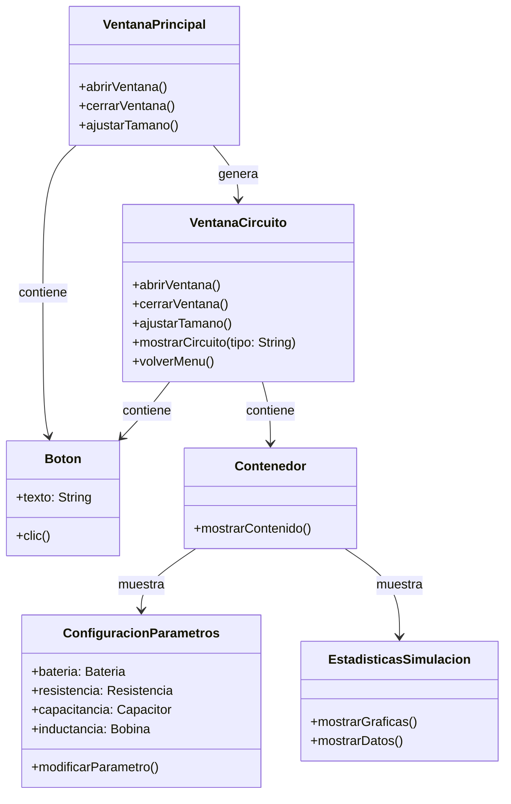
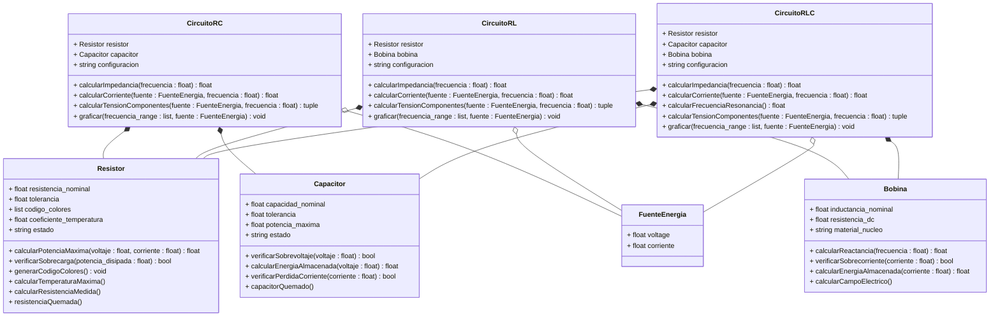

# **Simulador de circuitos**

## 📖Índice:
+ [Integrantes](#integrantes)
+ [Alternativa](#alternativa-4)
+ [Solución Preliminar](#solución-preliminar)
    + [Interfaz de Usuario](#parte-1-interfaz-de-usuario-gui)
        + [Frame 1: Menú](#frame-1-menú)
        + [Frame 2: Simulador](#frame-2-simulador)
        + [Diagrama de clases](#diagrama-de-clases-de-la-interfaz)
    + [Lógica del simulador](#parte-2-lógica-para-la-simulación-de-los-circuitos)
        + [Diagrama de clases](#diagrama-de-clases)
+ [Inspiración para la interfaz](#inspiración-para-la-interfaz)

## **Integrantes**
+ Juan Manuel Toro Rojas
+ Hector Miller Patiño Avellaneda
+ Miguel Angel Tovar Rincón

##  **Alternativa 4**
Desarrollar una aplicación en Python que permita simular circuitos RC, RL, RLC simples. Condiciones:

+ Código original
+ Uso de herramientas vistas en el curso (CLASES) - Los        componentes deben aplicar el enfoque de POO (e.g una Resistencia debe tener atributos como: resistividad, potencia, etc)
+ Se deben poder configurar los componentes en serie y en paralelo
+ Se deben trabajar con fuentes de tensión en DC unicamente
+ El resultado de la simulación deben ser las gráficas de tensión/corriente en cada uno de los componentes
+ Se pueden utilizar módulos externos para la solución de los componentes númericos

**Features extra:**
+ Hacer analisis en el dominio AC

## **Solución Preliminar**
Para desarrollar este simulador de circuitos simples de **RC. RL y RLC** es necesario tener en cuenta las partes que se deben desarrollar, para esta alternativa es necesario:
+ Interfaz de usuario (GUI)
+ Lógica para la simulación de los circuitos

### **Parte 1: Interfaz de Usuario (GUI):**
***
#### **Frame 1: (Menú)**
En esta parte, se da un mensaje de bienvenida y el usuario verá un menú principal que le permitirá seleccionar entre los tres tipos de señales que se pueden simular: RC, RL y RLC. Este menú será el primer frame que el usuario encuentre al iniciar la aplicación.

**Características del Menu**
+ Señal RC: Simulación de un circuito RC (Resistencia y Capacitor).
+ Señal RL: Simulación de un circuito RL (Resistencia e Inductor).
+ Señal RLC: Simulación de un circuito RLC (Resistencia, Inductor y Capacitor).

#### **Frame 2: (Simulador)** 
Este frame será una interfaz sencilla en la que el usuario va a observar el circuito seleccionado en el menú anterior, adicionalmente en un contonedor ubicado en la parte derecha de la pantalla, el usuario podra ingresar los parametros de cada componente del circuito en cajas de texto. El usuario ingresará valores para:
+ Resistencia.
+ Capacitor.
+ Inductor.
+ Fuente de energía.

Finalmente el usuario podra observar los datos del circuito en forma de gráficos en un contenedor ubicado en la parte inferior de la ventana, sin resaltar tambien que habrá una opción para volver al menú principal y la opción de realizar la simulación con los mismos componentes en un circuito en serie y paralelo.

### **Diagrama de clases de la interfaz**
A continuación se presenta el diagrama de clases de la GUI:

**Class VentanaPrincipal:**
Es la ventana inicial del simulador, donde el usuario puede seleccionar el tipo de circuito (RC, RL o RLC). Tiene métodos para abrir, cerrar y ajustar el tamaño.

**Class VentanaCircuito:**
Se genera cuando el usuario selecciona un tipo de circuito. Contiene métodos para abrir, cerrar, ajustar tamaño, mostrar el circuito y volver al menú principal.

**Class Boton:**
Representa los botones de la interfaz. Contiene un texto y un método clic() para activar una acción.

**Class Contenedor:**
Se encarga de mostrar los diferentes elementos en la interfaz.

**Class ConfiguracionParametros**
Contiene los valores de los componentes del circuito, como batería, resistencia, capacitancia e inductancia. Permite modificar estos valores.

**Class EstadisticaSimulacion**
Muestra las gráficas y datos generados por la simulación del circuito.

### **Parte 2: Lógica para la simulación de los circuitos**
***
Para el desarrollo de la lógica del simulador hay que tener en cuenta los factores que pueden afectar los valores de la simulación, como lo pueden ser los parametros de cada componente, dependiendo si esta en un circuito en serie o en paralelo, un buen primer paso es saber **que objetos van a existir** en este simulador, posteriormente **que datos deben ser ingresados** y **que datos pueden ser generados** para finalmente desarrollar una **salida de datos en forma de diagramas y estadisticas.**

**Objetos (Componentes):**
+ Fuente DC: Va a manejar el voltaje y la corriente.
+ Resistencia: Contiene el valor en ohmios de la resistencia.
+ Capacitor: Maneja la capacitancia en micro faradios.
+ Bobina: Representado con el valor en henrios de la inductancia.

**Objetos (Circuitos):**
+ Circuito: Representará un circuito eléctrico genérico. Contiene métodos y atributos comunes a todos los circuitos.
+ Circuito RC: Es un tipo de circuito especifico con una resistencia y un capacitor.
+ Circuito RL:  Este objeto es un circuito con una resistencia y un inductor.
+ Circuito RLC: Este es el ultimo tipo de circuito el cual contiene una resistencia, un capacitor y un inductor.

#### **Diagrama de Clases**
El diseño orientado a objetos se representa mediante el siguiente diagrama de clases:

## **Inspiración para la interfaz**
Un apoyo para la realización de este proyecto es una calculadora realizada el semestre pasado, en la que adquirmios conocimientos para programar y crear una interfaz grafica y proyectar datos por medio de graficas, dicha calculadora se encuentra en este repositorio de GitHub:
+ https://github.com/Mike-arch-code/Calculadora 